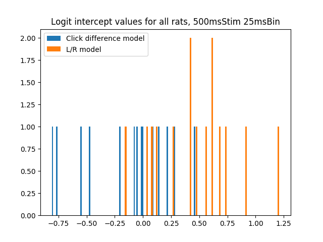

# Lab Notebook

# 2020-01-27

- Met with Chuck today to figure out how to access the larger PBups database.
  Essentially data is accessible through two places: through the jukebox server
  as raw data, and through bdata. The task now is to basically trawl through the
  settings for a given set of rats (like in Chuck's folder) and figure out:
  - Which are doing pbups
  - Which are doing it in the final stage, where they're at max perf
  - Where the settings finally stabilize for a continuous set of sessions
  EVENTUALLY
  - Whether these contain good enough performance / low enough proportion of
    violation trials that we can use it for the analysis. Chuck thinks that
    about 20k trials is good enough for the analysis.
  - Whether it's frequency or classic, and what rates (20 or 40 Hz)
  
- Should be able to write a (MATLAB?) script that takes a set of rats and
  perhaps dates or option like final_stage for stable final performance and give
  you back a .mat file that contains all of the standard stuff that Chuck's
  files have in `data/frozen_noise/`

# 2020-01-23

- Is it the case that the intercept (the first beta term) determines how
  off-diagonal the decision boundary is, while the weights of wtR and wtL are
  what determines the slope of that decision boundary? Yes.
- Going to add the bias term to the plots.

# 2020-01-22

- `data_preprocessing.jl` has been vastly refactored, such that processing a
  session produces a regressor matrix `X` for clicks locked to the onset and
  offset of the stimulus presentation.
- `summarize_rats.jl` now creates figure for each rat showing the 1D and 2D
  psychometric performance for rat and model, and the time-varying L/W weights.

# 2020-01-20

- Wrote up script that can summarize the data - provides 1D and 2D
  psychometric functions, and with model predictions overlaid as well.
- A few things to do:
  - [x] Some rats are pretty asymmetric: make decision completely based on L or
    R click number. This should show up on the L/R time-varying logit analysis.
  - [x] Validate that shifted decision boundary like above results in worse
    performance for one of the accumulation sides
  - [ ] Should we cross-validate for the logit weights analysis?
  - [ ] How does the 2D decision surface of the logit model vary as a function
    of time? Might be that they weigh one side a lot early on and then both, etc.

# 2020-01-16

- Finally have a full, automated pipeline for fitting logistic regressions to
  the click difference and L/R sides, time-locked to the end of the stimulus.
- Still need to do the following:
  - Implement plotting code that has 95 CIs
  - Implement preprocessing where data is time-locked to the beginning of the
    stimulus
  - Make surface plots like the ones Tyler has
- Interesting observation: the intercepts for the logit model become shifted
  when you go from a click diff model to a L/R model:
  

# 2020-01-15

- Need to make it such that we can fit logistic regression to either to the
  beginning of the stimulus or the end of the stimulus presentation.

# 2020-01-14

- Figured out how to fit a logistic regression using the GLM.jl package to the
  simulated data from NEU314. Now to fit to Chuck's data!

# 2020-01-13

- Want to learn GLM stuff today so I can start implementing it.
  
  - Monday: Learn GLM stuff, start implementing it and getting data read in.
  - Tuesday: Get data read in, implementing GLM.
  - Wednesday: Have general function for fitting logit model to rats.
  - Thursday: Inspect fits to multiple rats.
  - Friday: Continue inspecting.
  - Tuesday (next week): Be fitting to multiple datasets.

- Going to use GLM.jl to build the logistic regression analysis. bdata works,
  (you just have to be connected to the Princeton VPN), and I have the frozen
  noise data from Chuck.
  
  It has the following fields (opening up an _ALL.mat file)
  
  - vh: Violation history
  - hh: hit history, violated trials show up as NaNs
  - pd: Garbage (duration of stimulus, but messed up?)
  - sd: Stimulus duration
  - sh: Stimulator history, for opto.
  - seed: Seed used to generate the trial
  - is_frozen: If it's a frozen trial
  - parsed: struct, contains previous data but cleaned of violated trials.
    Contains the following fields:
    
        - bd: Bup difference at the end of the trial
        - gr: Whether the rat went right (1, went right, 0, went left)
        - b: Clicktimes
            - right: Clicktimes [s] for right
            - left:  Clicktimes [s] for left
        - g: gamma (log ratio of left and right click rates). Pos gamma means
          rightward trial, neg gamma means left trial. Larger absolute gamma,
          easier trial. Note that a trial's gamma was how Brodylab used to
          reward trials. However, at low magnitude gamma this means that even
          if the gamma is positive, you can end up generating a trial with more
          left clicks. Holdover from the random dot motion task, in which the
          monkeys are sorta trying to estimate the generative process itself.
          Chuck says that somewhere between 1 - 4% of trials are wrong.
        - hh: Hit history, again (1 = correct, 0 = incorrect answer)
        - pd: Duration of stimulus. This is the amount of time that clicks were
          allowed to occur within. Ranges from 200 to 1000 ms. Note that the
          trial itself is 1.5 seconds long, and the stimulus window is anchored
          to the end of the trial. Thus, rats know to stop accumulating at 1.5
          seconds, regardless of when the stimulus starts.

# 2020-01-12

Implemented function that groups trials into NGROUPS (for example, trials with
-30 to -20 evidence, -19 to -10, etc). 
    TODO: probably best to make it such that the inside group (-6, 6)
    is the only one with inclusive boundaries? All other groups are
    inclusive on the number away from center, but exclusive for one
    towards center. idk.
