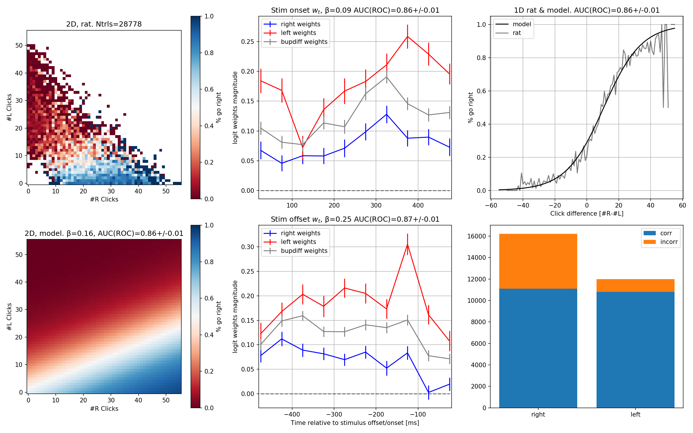

# Logistic regression

Julia code for fitting various logistic regression models to the rat behavioral
data from the Poisson clicks task. Allows us to assess L/R bias, as well as
temporal discounting. Uses the GLM.jl package.

In short, fits the following four models:

### 1D click difference

### 2D, total number of right and left clicks

### Click difference across time

### Number of right and left clicks across time

Producing, for each rat, a figure that looks like the following:

## To do

- [ ] Major refactor to make the code easier to use
- [ ] Use stratified (across gammas) kfold cv for the estimation of params and their error bars
    - [ ] Make sure that the X matrices contain gammas
- [ ] Check that other generalization metrics also show same trends as AUC(ROC)
- [ ] Visualize how separable the `w * X + beta` distributions are prior to feeding into the logit model
- [ ] Metarat analysis: could fit to one giant collated matrix or average logit weights
- [ ] Explore different bin sizes - are 20Hz rats fit worse bc of low click count per bin?

